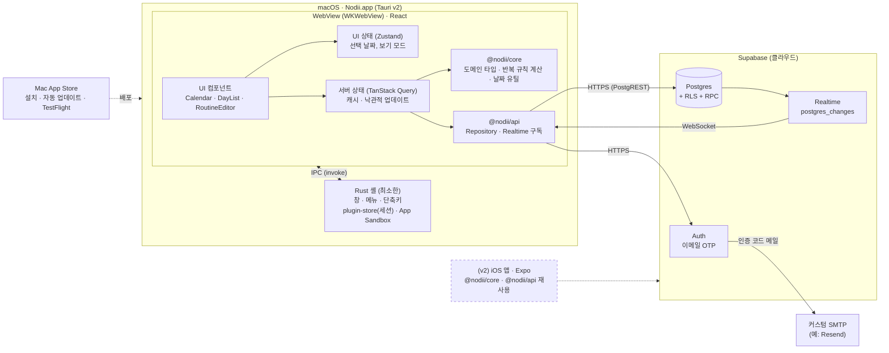
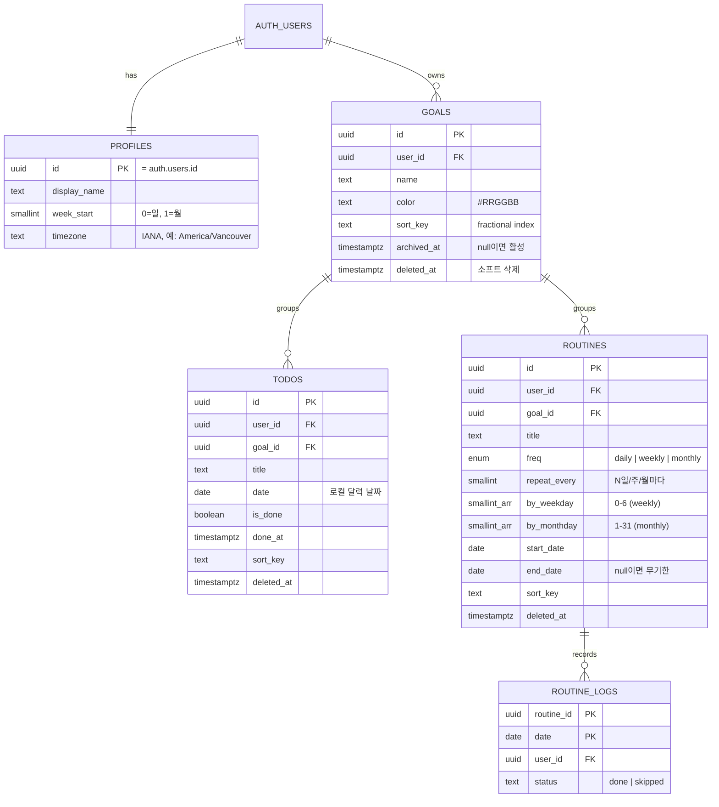
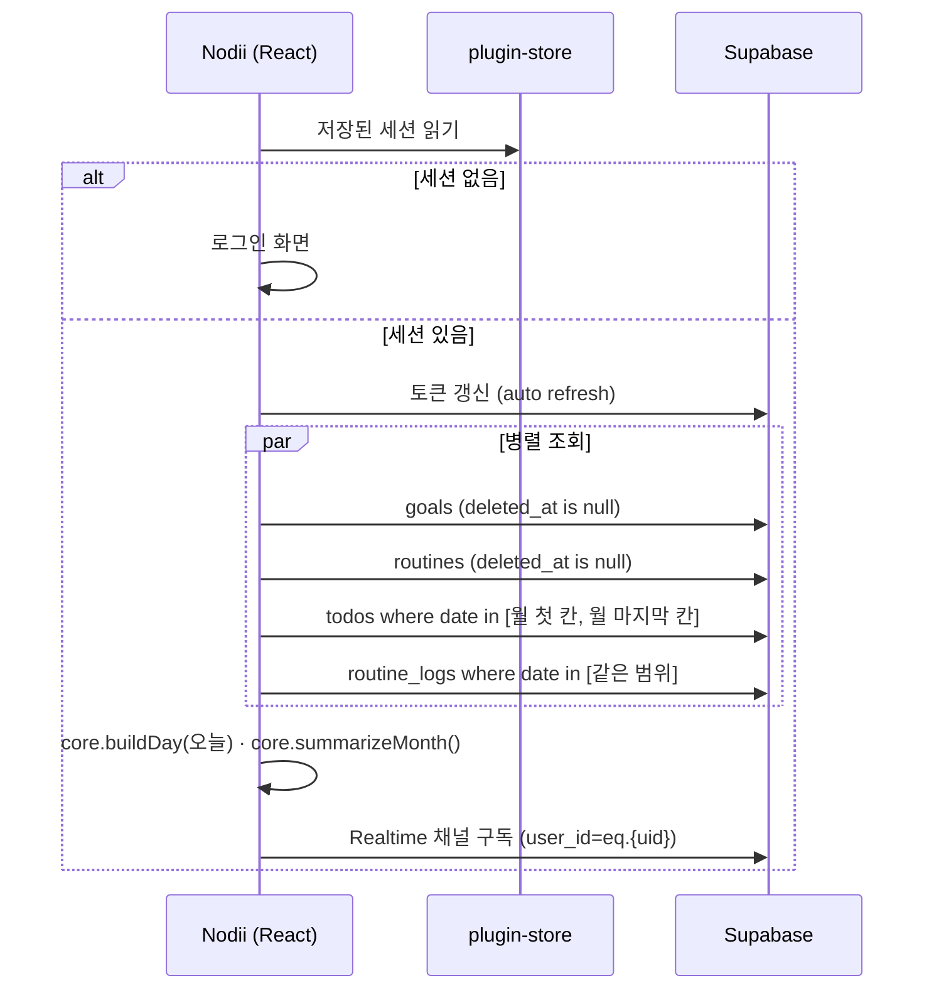
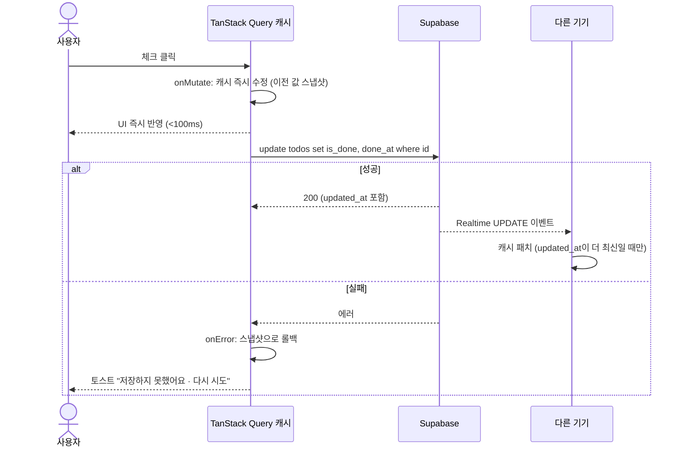
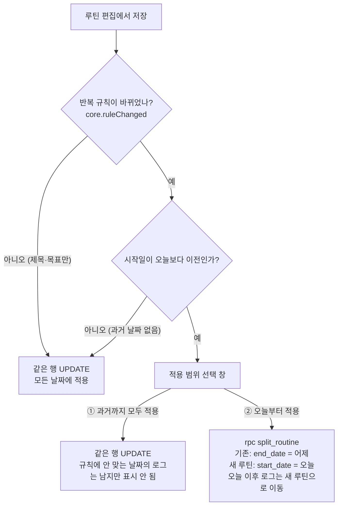

# Nodii 시스템 설계서 (MVP)

> 버전 1.0 · 2026-09-17 · 근거 문서: `01-requirements.md` v1.0 · 상태: **확정 (기준선)**
> 확정된 결정: **macOS 전용** · **Tauri v2 + React + TypeScript** · **Supabase(로그인 + 클라우드 DB)** · MVP 기능 = 목표·할 일 / 월간 캘린더 / 루틴 · **이메일 OTP 로그인** · **Mac App Store 출시**
> v0.2 변경: 루틴 규칙 수정 시 범위 선택과 분할(§6.4), 지난 미완료 할 일 가져오기(§6.6), OTP 확정(§6.5), RPC 함수 2개(§4.5)
> v0.3 변경: Mac App Store 배포 파이프라인과 샌드박스(§11), 자체 업데이트 제거, 심사용 데모 계정(§6.5), 최소 지원 버전 확인(§6.7, `app_config` 테이블)
> v1.0 변경: 번들 ID `com.sungjunlee.Nodii` 확정, App Store Connect 앱 등록 완료, 카테고리 생산성·무료 확정(§11)

---

## 1. 아키텍처 개요



### 핵심 원칙
1. **서버가 기준 데이터(Single Source of Truth).** 클라이언트는 캐시만 가집니다. 기기 간 불일치를 원천적으로 줄이기 위한 선택입니다.
2. **도메인 로직은 UI와 분리.** 반복 규칙 계산이나 날짜별 집계는 `@nodii/core`에 순수 함수로 두고, 나중에 모바일 앱에서 그대로 재사용합니다.
3. **Rust는 최소한으로.** 데이터 처리는 모두 TypeScript에서 하고, Rust 쪽은 OS 연동(창, 메뉴 막대, 저장소)만 맡습니다.
4. **동기화하기 좋은 스키마.** UUID는 클라이언트에서 생성하고, `updated_at`을 자동 갱신하고, 날짜는 `date` 타입을 씁니다. 이렇게 해 두면 v2에서 PowerSync 같은 오프라인 동기화 엔진을 붙일 때 스키마를 바꾸지 않아도 됩니다.

---

## 2. 기술 스택

| 영역 | 선택 | 이유 |
|---|---|---|
| 데스크톱 셸 | **Tauri v2** | 앱 크기 2~10MB, 낮은 메모리 사용량, iOS 빌드 경로도 열려 있음 |
| UI | React 19 + TypeScript + Vite | 이미 익숙한 스택 |
| 스타일 | Tailwind CSS + Radix UI(shadcn/ui) | 빠른 개발, 접근성, 다크 모드 |
| 서버 상태 | TanStack Query | 캐시, 낙관적 업데이트, 실패 시 롤백, 재시도 |
| UI 상태 | Zustand | 가볍고, 보일러플레이트가 적음 |
| 날짜 | date-fns | 트리 셰이킹, 불변성 |
| 드래그 앤 드롭 | dnd-kit | 순서 변경, 캘린더로 드래그 |
| 정렬 키 | `fractional-indexing` | 순서를 바꿀 때 행 1개만 수정 (§4.4) |
| 백엔드 | Supabase (Postgres, Auth, Realtime) | 서버 코드 없이 로그인, DB, 실시간 반영 |
| 세션 저장 | `@tauri-apps/plugin-store` | supabase-js 저장소 어댑터로 사용 |
| 인증 메일 | 커스텀 SMTP (예: Resend) | Supabase 기본 메일 서버는 테스트용이라 발송량 제한이 낮음 |
| 배포와 업데이트 | Mac App Store + TestFlight | Q7 확정. 스토어 앱은 자체 업데이트 기능을 쓸 수 없으므로 `plugin-updater`는 넣지 않음 |
| 테스트 | Vitest, Testing Library, pgTAP(RLS) | 단위, 컴포넌트, DB 정책 |
| 모노레포 | pnpm workspaces | 모바일 앱과 코드 공유 (Turborepo는 필요해지면 도입) |
| CI/CD | GitHub Actions (macOS 러너) | Universal 빌드 → `.pkg` 서명 → App Store Connect 업로드 (§11) |

---

## 3. 저장소 구조 (모노레포)

```
nodii/
├─ apps/
│  ├─ desktop/                # Tauri v2 앱
│  │  ├─ src/                 # React
│  │  │  ├─ app/              # 라우팅 · Provider · 레이아웃
│  │  │  ├─ features/
│  │  │  │  ├─ auth/
│  │  │  │  ├─ calendar/
│  │  │  │  ├─ day-list/      # 목표별 할 일 + 루틴 목록
│  │  │  │  ├─ goals/
│  │  │  │  ├─ routines/
│  │  │  │  └─ settings/
│  │  │  ├─ components/ui/    # shadcn 컴포넌트
│  │  │  └─ lib/              # tauri 저장소 어댑터, 단축키
│  │  └─ src-tauri/           # Rust 셸, tauri.conf.json, capabilities,
│  │                          # Entitlements.plist, Info.plist (App Store용, §11)
│  └─ mobile/                 # (v2) Expo
├─ packages/
│  ├─ core/                   # 순수 TS: 타입, 반복 규칙, 날짜별 집계 (UI/네트워크 의존성 없음)
│  └─ api/                    # supabase 클라이언트, repository, query 훅, realtime
├─ supabase/
│  ├─ migrations/             # SQL 마이그레이션 (§4.3)
│  ├─ tests/                  # pgTAP RLS 테스트
│  └─ config.toml
└─ docs/                      # 이 문서들
```

**의존 방향:** `apps/*` → `packages/api` → `packages/core`. `core`는 아무것도 의존하지 않습니다.

---

## 4. 데이터 설계

### 4.1 ERD



### 4.2 핵심 설계 결정

| 결정 | 선택 | 대안 | 이유 |
|---|---|---|---|
| **루틴을 날짜별로 어떻게 표현할까** | **가상 전개**: 규칙만 저장하고, 날짜별 항목은 클라이언트에서 계산. 완료나 건너뛰기만 `routine_logs`에 기록 | 앞으로 N일치 todo 행을 미리 생성 | 규칙을 바꿀 때 미래 행을 다시 만들 필요가 없고, 저장량이 작고, 종료일이 없는 무기한 루틴도 자연스럽게 처리됨. 계산 로직은 `core`에 두고 모바일과 공유 |
| 할 일 날짜 타입 | `date` (시각 없음) | `timestamptz` | "9월 16일의 할 일"은 시각이 아니라 달력 날짜임. 시간대를 옮겨도 날짜가 밀리지 않음 |
| 삭제 방식 | 목표, 할 일, 루틴은 **소프트 삭제**(`deleted_at`). 루틴 기록은 실제 삭제 | 모두 실제 삭제 | 실행 취소, 이력 보존(차별화 포인트). 루틴 기록은 완료 해제 = 행 삭제가 가장 단순함 |
| 목표 삭제와 보관 | 보관(`archived_at`)을 기본 동작으로 둠 | 삭제하면 속한 할 일까지 연쇄 삭제 | 투두메이트 리뷰 불만(과거 할 일 영구 삭제) 해결 |
| 정렬 | `sort_key text collate "C"` + fractional indexing | 정수 `position` | 순서를 바꿀 때 행 1개만 UPDATE하면 됨. 여러 기기에서 동시에 바꿔도 충돌이 적음 |
| ID 생성 | 클라이언트에서 `crypto.randomUUID()` | DB 기본값만 사용 | 낙관적 업데이트 때 서버 응답을 기다리지 않고 ID를 확정할 수 있음 (DB 기본값도 함께 둠) |
| 소유권 무결성 | `(goal_id, user_id)` **복합 FK** | RLS만으로 보호 | 다른 사람의 목표 ID로 할 일을 만드는 공격을 DB 수준에서 차단 |
| 루틴 규칙 수정 (Q3) | 사용자가 범위를 고름. **과거까지 모두** → 같은 행을 UPDATE / **오늘부터** → `split_routine` RPC로 기존 루틴을 어제 종료하고 새 루틴을 오늘 시작 | 항상 한 방식만 사용 | 두 동작이 모두 기존 스키마로 표현됨. 분할은 행 2개와 로그 이동이 한 트랜잭션에서 일어나야 하므로 RPC로 묶음 |
| 활성 목표 1개 이상 (Q5) | 클라이언트에서 막고, **DB 트리거로도 강제** | 클라이언트에서만 막기 | 다른 기기나 향후 모바일 앱에서도 규칙이 깨지지 않음 |

### 4.3 스키마 (초기 마이그레이션 초안)

```sql
-- ============ 공통: updated_at 자동 갱신 ============
create or replace function public.set_updated_at()
returns trigger language plpgsql as $$
begin
  new.updated_at = now();
  return new;
end;
$$;

-- ============ profiles ============
create table public.profiles (
  id           uuid primary key references auth.users (id) on delete cascade,
  display_name text,
  week_start   smallint not null default 0 check (week_start in (0, 1)),
  timezone     text not null default 'UTC',
  created_at   timestamptz not null default now(),
  updated_at   timestamptz not null default now()
);

-- 가입 시 profile + 기본 목표 자동 생성
create or replace function public.handle_new_user()
returns trigger language plpgsql security definer set search_path = '' as $$
begin
  insert into public.profiles (id) values (new.id);
  insert into public.goals (user_id, name, color, sort_key)
  values (new.id, '할 일', '#4F7CFF', 'a0');
  return new;
end;
$$;

create trigger on_auth_user_created
  after insert on auth.users
  for each row execute function public.handle_new_user();

-- ============ goals ============
create table public.goals (
  id          uuid primary key default gen_random_uuid(),
  user_id     uuid not null default auth.uid() references auth.users (id) on delete cascade,
  name        text not null check (char_length(name) between 1 and 50),
  color       text not null check (color ~ '^#[0-9A-Fa-f]{6}$'),
  sort_key    text collate "C" not null,
  archived_at timestamptz,
  created_at  timestamptz not null default now(),
  updated_at  timestamptz not null default now(),
  deleted_at  timestamptz,
  unique (id, user_id)
);
create index goals_user_idx on public.goals (user_id) where deleted_at is null;

-- ============ todos ============
create table public.todos (
  id         uuid primary key default gen_random_uuid(),
  user_id    uuid not null default auth.uid() references auth.users (id) on delete cascade,
  goal_id    uuid not null,
  title      text not null check (char_length(title) between 1 and 200),
  date       date not null,
  is_done    boolean not null default false,
  done_at    timestamptz,
  sort_key   text collate "C" not null,
  created_at timestamptz not null default now(),
  updated_at timestamptz not null default now(),
  deleted_at timestamptz,
  foreign key (goal_id, user_id) references public.goals (id, user_id) on delete cascade,
  check (is_done = (done_at is not null))
);
create index todos_user_date_idx on public.todos (user_id, date) where deleted_at is null;

-- ============ routines ============
create type public.routine_freq as enum ('daily', 'weekly', 'monthly');

create table public.routines (
  id           uuid primary key default gen_random_uuid(),
  user_id      uuid not null default auth.uid() references auth.users (id) on delete cascade,
  goal_id      uuid not null,
  title        text not null check (char_length(title) between 1 and 200),
  freq         public.routine_freq not null,
  repeat_every smallint not null default 1 check (repeat_every between 1 and 365),
  by_weekday   smallint[] check (by_weekday <@ array[0,1,2,3,4,5,6]::smallint[]),
  by_monthday  smallint[] check (by_monthday <@ array[1,2,3,4,5,6,7,8,9,10,11,12,13,14,15,16,
                                                      17,18,19,20,21,22,23,24,25,26,27,28,29,30,31]::smallint[]),
  start_date   date not null,
  end_date     date check (end_date is null or end_date >= start_date),
  sort_key     text collate "C" not null,
  created_at   timestamptz not null default now(),
  updated_at   timestamptz not null default now(),
  deleted_at   timestamptz,
  unique (id, user_id),
  foreign key (goal_id, user_id) references public.goals (id, user_id) on delete cascade,
  check ((freq = 'weekly')  = (coalesce(cardinality(by_weekday), 0)  > 0)),
  check ((freq = 'monthly') = (coalesce(cardinality(by_monthday), 0) > 0))
);
create index routines_user_idx on public.routines (user_id) where deleted_at is null;

-- ============ routine_logs ============
create table public.routine_logs (
  routine_id uuid not null,
  date       date not null,
  user_id    uuid not null default auth.uid() references auth.users (id) on delete cascade,
  status     text not null check (status in ('done', 'skipped')),
  created_at timestamptz not null default now(),
  updated_at timestamptz not null default now(),
  primary key (routine_id, date),
  foreign key (routine_id, user_id) references public.routines (id, user_id) on delete cascade
);
create index routine_logs_user_date_idx on public.routine_logs (user_id, date);

-- ============ updated_at 트리거 ============
create trigger profiles_updated_at     before update on public.profiles     for each row execute function public.set_updated_at();
create trigger goals_updated_at        before update on public.goals        for each row execute function public.set_updated_at();
create trigger todos_updated_at        before update on public.todos        for each row execute function public.set_updated_at();
create trigger routines_updated_at     before update on public.routines     for each row execute function public.set_updated_at();
create trigger routine_logs_updated_at before update on public.routine_logs for each row execute function public.set_updated_at();

-- ============ RLS: 본인 데이터만 ============
alter table public.profiles     enable row level security;
alter table public.goals        enable row level security;
alter table public.todos        enable row level security;
alter table public.routines     enable row level security;
alter table public.routine_logs enable row level security;

create policy "own profile" on public.profiles for all to authenticated
  using (id = (select auth.uid())) with check (id = (select auth.uid()));
create policy "own goals" on public.goals for all to authenticated
  using (user_id = (select auth.uid())) with check (user_id = (select auth.uid()));
create policy "own todos" on public.todos for all to authenticated
  using (user_id = (select auth.uid())) with check (user_id = (select auth.uid()));
create policy "own routines" on public.routines for all to authenticated
  using (user_id = (select auth.uid())) with check (user_id = (select auth.uid()));
create policy "own routine_logs" on public.routine_logs for all to authenticated
  using (user_id = (select auth.uid())) with check (user_id = (select auth.uid()));

-- ============ Realtime ============
alter publication supabase_realtime add table public.goals, public.todos, public.routines, public.routine_logs;
```

> 참고: RLS 정책 안의 `auth.uid()`를 `(select auth.uid())`로 감싸면 행마다 함수를 다시 호출하지 않아서, Supabase가 권장하는 성능 패턴입니다.

### 4.4 정렬 키 (fractional indexing)
- 할 일 A(`a0`)와 B(`a1`) 사이에 C를 끼워 넣으면 C의 키는 `a0V`처럼 **두 키 사이의 문자열**이 됩니다. UPDATE는 C 한 행만 일어납니다.
- 정렬은 반드시 바이트 순서로 해야 해서 `collate "C"`를 지정했습니다.

### 4.5 RPC 함수와 규칙 트리거 (v0.2 추가)

```sql
-- ============ 활성 목표 1개 이상 유지 (GOAL-07) ============
create or replace function public.ensure_active_goal()
returns trigger language plpgsql set search_path = '' as $$
begin
  if (new.archived_at is not null or new.deleted_at is not null)
     and old.archived_at is null and old.deleted_at is null
     and not exists (
       select 1 from public.goals g
        where g.user_id = new.user_id and g.id <> new.id
          and g.archived_at is null and g.deleted_at is null)
  then
    raise exception 'at least one active goal is required';
  end if;
  return new;
end;
$$;

create trigger goals_ensure_active
  before update on public.goals
  for each row execute function public.ensure_active_goal();

-- ============ 루틴 분할: "오늘부터 적용" (ROUT-08 ②) ============
-- 기존 루틴은 p_from 전날에 종료하고, 새 규칙의 루틴을 p_from부터 시작한다.
-- p_from 이후 날짜에 이미 남긴 완료/건너뛰기 기록은 새 루틴으로 옮긴다.
create or replace function public.split_routine(
  p_routine_id   uuid,
  p_from         date,                    -- 클라이언트가 사용자 시간대로 계산한 "오늘"
  p_title        text,
  p_goal_id      uuid,
  p_freq         public.routine_freq,
  p_repeat_every smallint,
  p_by_weekday   smallint[],
  p_by_monthday  smallint[],
  p_new_id       uuid default gen_random_uuid()  -- 낙관적 업데이트용으로 클라이언트가 넘길 수 있음
) returns uuid
language plpgsql security invoker set search_path = '' as $$
declare
  v_old public.routines;
begin
  select * into v_old
    from public.routines
   where id = p_routine_id and deleted_at is null
     for update;

  if not found then
    raise exception 'routine not found';
  end if;
  if v_old.start_date >= p_from then
    raise exception 'no past occurrences: update the routine in place instead';
  end if;
  if v_old.end_date is not null and v_old.end_date < p_from then
    raise exception 'routine already ended';
  end if;

  insert into public.routines
    (id, user_id, goal_id, title, freq, repeat_every, by_weekday, by_monthday, start_date, end_date, sort_key)
  values
    (p_new_id, v_old.user_id, p_goal_id, p_title, p_freq, p_repeat_every, p_by_weekday, p_by_monthday,
     p_from, v_old.end_date, v_old.sort_key);

  update public.routine_logs
     set routine_id = p_new_id
   where routine_id = p_routine_id and date >= p_from;

  update public.routines
     set end_date = p_from - 1
   where id = p_routine_id;

  return p_new_id;
end;
$$;

-- ============ 할 일 여러 개를 한 날짜로 옮기기 (TODO-10, CAL-06) ============
-- p_moves: [{"id": "...", "sort_key": "..."}] · 정렬 키는 클라이언트가 목표별 맨 아래 위치로 계산
create or replace function public.move_todos(p_moves jsonb, p_date date)
returns void
language sql security invoker set search_path = '' as $$
  update public.todos t
     set date = p_date,
         sort_key = m.sort_key
    from jsonb_to_recordset(p_moves) as m(id uuid, sort_key text)
   where t.id = m.id and t.deleted_at is null;
$$;

revoke execute on function public.split_routine(uuid, date, text, uuid, public.routine_freq, smallint, smallint[], smallint[], uuid) from public, anon;
grant  execute on function public.split_routine(uuid, date, text, uuid, public.routine_freq, smallint, smallint[], smallint[], uuid) to authenticated;
revoke execute on function public.move_todos(jsonb, date) from public, anon;
grant  execute on function public.move_todos(jsonb, date) to authenticated;

-- ============ 앱 설정: 최소 지원 버전 (SET-05, v0.3 추가) ============
create table public.app_config (
  key        text primary key,
  value      text not null,
  updated_at timestamptz not null default now()
);
alter table public.app_config enable row level security;
-- 로그인 전에도 읽을 수 있어야 하므로 anon 포함, 쓰기 정책은 두지 않음 (대시보드/마이그레이션으로만 변경)
create policy "anyone can read config" on public.app_config for select to anon, authenticated using (true);
insert into public.app_config (key, value) values ('min_macos_app_version', '0.1.0');
```

- 두 함수 모두 `security invoker`라서 **호출한 사용자의 RLS가 그대로 적용**됩니다. 다른 사람의 루틴이나 할 일은 조회 단계에서 보이지 않아서 수정할 수 없습니다.
- 분할 뒤에는 기존 루틴(어제 종료)과 새 루틴(오늘 시작)이 따로 존재합니다. 루틴 목록(ROUT-10)은 종료되지 않은 루틴만 보여주므로 사용자에게는 루틴 하나로 보입니다.

---

## 5. 도메인 로직 (`@nodii/core`)

### 5.1 타입
```ts
export type ISODate = string; // 'YYYY-MM-DD' (로컬 달력 날짜)

export interface Goal    { id: string; name: string; color: string; sortKey: string; archivedAt: string | null }
export interface Todo    { id: string; goalId: string; title: string; date: ISODate; isDone: boolean; sortKey: string }
export interface Routine {
  id: string; goalId: string; title: string;
  freq: 'daily' | 'weekly' | 'monthly';
  repeatEvery: number;
  byWeekday: number[] | null;   // 0=일 … 6=토
  byMonthday: number[] | null;  // 1…31
  startDate: ISODate; endDate: ISODate | null; sortKey: string;
}
export interface RoutineLog { routineId: string; date: ISODate; status: 'done' | 'skipped' }

/** 화면에 그리는 한 줄: 할 일과 루틴을 합친 형태 */
export type DayItem =
  | { kind: 'todo';    goalId: string; sortKey: string; todo: Todo }
  | { kind: 'routine'; goalId: string; sortKey: string; routine: Routine; log: RoutineLog | null };
```

### 5.2 반복 규칙 판정 `occursOn(routine, date)`
```
if date < startDate or (endDate and date > endDate): false
daily   : daysBetween(startDate, date) % repeatEvery == 0
weekly  : weekday(date) ∈ byWeekday
          and weeksBetween(weekStartOf(startDate), weekStartOf(date)) % repeatEvery == 0
monthly : monthsBetween(startDate, date) % repeatEvery == 0
          and ( day(date) ∈ byMonthday
                or (isLastDayOfMonth(date) and any(d > day(date) for d in byMonthday)) )  ← Q2 확정: 그 날짜가 없는 달은 말일에 표시
```

### 5.3 주요 함수
| 함수 | 역할 |
|---|---|
| `expandRoutines(routines, logs, from, to)` | 기간 안의 루틴 항목을 날짜별 `DayItem[]`으로 펼침 |
| `buildDay(goals, todos, routines, logs, date)` | 하루 목록을 만듦: 목표 순서 → 항목 `sortKey` 순. 루틴 로그가 `skipped`면 제외 |
| `summarizeMonth(...)` | 캘린더용 `Map<ISODate, { remaining, total }>` |
| `todayISO(tz)` | 사용자 시간대 기준 오늘 날짜 |
| `ruleChanged(before, after)` | 반복 규칙 필드(`freq`, `repeatEvery`, `byWeekday`, `byMonthday`, `startDate`)가 바뀌었는지 판정. 제목과 목표만 바뀌었으면 `false` |
| `needsScopePrompt(routine, after, today)` | `ruleChanged && routine.startDate < today`일 때만 적용 범위를 묻는 창을 띄움 (ROUT-08) |
| `planOverdueMove(overdueTodos, todayTodos, today)` | 가져올 할 일마다 목표별 맨 아래 정렬 키를 계산해서 `move_todos` 인자를 만듦 (TODO-10) |

**계산 비용:** 한 달(최대 42칸) × 루틴 50개 = 약 2,100번 판정이라 무시할 만한 수준입니다.
**테스트 필수 케이스:** 윤년 2월 29일, 31일 규칙 × 30일까지 있는 달, 29·30·31일 규칙 × 2월, 주 시작 요일 차이, `repeatEvery > 1`, 종료일 당일, DST 전환일, 분할 직후 전날과 당일의 표시.

---

## 6. 주요 흐름

### 6.1 앱 시작


### 6.2 할 일 완료 체크 (낙관적 업데이트 + 실시간 반영)


- **내 변경이 Realtime으로 되돌아올 때:** `id`로 찾아서 `updated_at`을 비교합니다. 캐시에 있는 값과 같거나 캐시가 더 최신이면 무시하므로, 같은 변경이 두 번 적용되지 않습니다.
- **충돌 정책 (MVP):** 마지막에 쓴 값이 이깁니다(Last-Write-Wins). 한 사람이 쓰는 앱이라 충분합니다.

### 6.3 루틴 완료 체크
- 완료: `insert into routine_logs (routine_id, date, status) values (…, 'done')`, 충돌 시 `status`를 갱신(upsert)
- 완료 취소: 해당 `(routine_id, date)` 행 삭제
- 이날만 건너뛰기: upsert `status = 'skipped'`

### 6.4 루틴 수정, 종료, 삭제 (ROUT-08, ROUT-09)

**수정 (Q3 확정: 규칙이 바뀌면 적용 범위를 묻는다)**



- ①에서 표시하지 않게 된 로그는 삭제하지 않습니다. 사용자가 규칙을 되돌리면 기록이 다시 보입니다.
- 선택 창 문구 (초안): "반복 규칙을 바꿨어요. 어디부터 적용할까요?" · [과거 날짜까지 모두] [오늘부터] · 보조 설명 "오늘부터를 고르면 어제까지의 기록과 표시는 그대로 남아요"
- 낙관적 업데이트: ②는 캐시에서 기존 루틴의 `end_date`를 바꾸고 새 루틴(`p_new_id`)을 추가한 뒤 RPC를 호출하고, 실패하면 둘 다 되돌립니다.

**종료와 삭제**
- **오늘부터 그만하기:** `end_date = 어제`. 과거 기록과 과거 표시가 그대로 남습니다.
- **완전 삭제:** `deleted_at = now()`. 모든 날짜에서 사라지고, 로그는 남지만 표시되지 않습니다.

### 6.5 로그인 (Q1 확정: 이메일 OTP)
1. 사용자가 이메일 입력 → `auth.signInWithOtp({ email, options: { shouldCreateUser: true } })`
2. 메일로 받은 6자리 코드 입력 → `auth.verifyOtp({ email, token, type: 'email' })`
3. 세션을 plugin-store에 저장하고, 이후에는 자동 갱신

**Supabase 설정 체크리스트**
- 이메일 템플릿 **Magic Link**(기존 사용자)와 **Confirm signup**(새 사용자) 두 곳 모두에 링크 대신 **`{{ .Token }}`**(6자리 코드)을 넣습니다. 링크만 있으면 사용자가 코드를 받지 못합니다.
- Auth → SMTP에 커스텀 SMTP를 연결하고, 발신 도메인에 SPF와 DKIM을 설정합니다 (NFR-15, Q9).
- 재전송 간격 60초(AUTH-07)는 서버 설정과 맞추고, 클라이언트에서도 카운트다운 버튼으로 표시합니다.

**App Store 심사용 데모 계정 (AUTH-08)**

심사자는 인증 메일을 받을 수 없어서 별도 경로가 필요합니다. Supabase는 이메일 OTP용 "고정 테스트 코드"를 공식 지원하지 않고, `auth.users`의 토큰 값을 트리거로 덮어쓰는 커뮤니티 우회법은 Supabase 업데이트 후 깨졌다는 보고가 있어서 쓰지 않습니다.

1. Supabase 대시보드에서 심사 전용 사용자(예: `appreview@nodii.app`)를 **강한 난수 비밀번호**로 만들고, 예시 목표·할 일·루틴을 넣어 둡니다.
2. 앱은 빌드 시 상수 `REVIEW_ACCOUNT_EMAIL`을 가집니다. 입력한 이메일이 이 값과 정확히 같을 때만 비밀번호 입력란을 보여주고 `auth.signInWithPassword`를 호출합니다. 그 외에는 항상 OTP 흐름입니다.
3. 이메일과 비밀번호는 App Store Connect의 **심사 노트(Sign-in information)**에만 적고, 저장소에는 비밀번호를 커밋하지 않습니다.
4. 제출할 때마다 로그인이 되는지 확인하고, 심사가 끝나면 필요할 때 비밀번호를 교체합니다.

→ 데모 계정도 RLS로 격리되어 있어서, 비밀번호가 새더라도 노출되는 것은 데모 데이터뿐입니다.

→ 브라우저로 나갔다가 앱으로 돌아오는 **딥링크 처리가 필요 없어서** 데스크톱에서 가장 단순합니다. Google/Apple 로그인(AUTH-05)은 v2에서 `tauri-plugin-deep-link`(`nodii://auth/callback`)로 추가합니다. Mac App Store에서 제3자 소셜 로그인을 제공하면 "Sign in with Apple"도 함께 제공해야 하는 점을 v2 설계 때 고려합니다.

### 6.6 지난 미완료 할 일 가져오기 (Q4 확정, TODO-10)
1. 오늘 날짜를 보고 있을 때만 `['overdue', today]` 쿼리를 실행합니다:
   `todos where is_done = false and deleted_at is null and date between today-7 and today-1`
   (`todos_user_date_idx` 인덱스 사용)
2. 결과가 1개 이상이면 목록 맨 위에 배너를 띄웁니다: **"지난 미완료 할 일 N개 가져오기"**
3. 누르면 `core.planOverdueMove`로 목표별 맨 아래 정렬 키를 계산하고 → `rpc('move_todos', { p_moves, p_date: today })`
4. 낙관적 업데이트로 원래 날짜의 캐시에서 빼고 오늘 캐시에 넣고, 배너를 숨깁니다. 실패하면 되돌립니다.
5. 보관된 목표의 할 일은 가져오지 않습니다. 보관한 목표는 오늘 이후 목록에 나오지 않기 때문입니다(GOAL-05). 필터는 `['goals']` 캐시로 클라이언트에서 적용합니다.

- 자동 이월은 하지 않습니다. 사용자가 누를 때만 옮깁니다.
- 기간은 **7일로 확정**(Q8)했고, 나중에 조정하기 쉽게 `@nodii/core`의 상수 `OVERDUE_LOOKBACK_DAYS = 7`로 둡니다.

### 6.7 최소 지원 버전 확인 (SET-05)
App Store는 사용자가 업데이트를 미룰 수 있어서, DB 스키마를 바꿀 때 오래된 앱이 깨질 수 있습니다.
1. 앱 시작 시(로그인 전) `app_config`에서 `min_macos_app_version`을 읽습니다.
2. 앱 버전(`@tauri-apps/api/app`의 `getVersion()`)이 더 낮으면 전체 화면 안내를 띄우고, 버튼으로 App Store의 Nodii 페이지(`macappstore://apps.apple.com/app/id<APP_ID>`)를 엽니다.
3. 읽기에 실패하면(오프라인 등) 막지 않고 그냥 진행합니다.
4. **호환성이 깨지는 마이그레이션**을 배포하는 순서: 새 앱 버전 심사 통과 → 스토어 출시 → `min_macos_app_version` 올리기 → 마이그레이션 적용.

---

## 7. 화면 구조

```
┌───────────────────────────────────────────────────────────────┐
│ ● ● ●   Nodii                            [오프라인] [⚙]       │
├──────────────────────────┬────────────────────────────────────┤
│  ◀  2026년 9월  ▶ [오늘] │  9월 16일 (수) · 오늘     ◀  ▶     │
│  일 월 화 수 목 금 토    │  ┌ 지난 미완료 할 일 3개 [가져오기]┐│
│      1  2  3  4  5       │  ● 공부                      [+]   │
│   6  7  8  9 10 11 12    │    ☑ 알고리즘 2문제                │
│  13 14 15 [16]17 18 19   │    ☐ OS 과제                       │
│   ✓  3  2   4            │    ↻ ☐ 영어 단어 30개   (루틴)     │
│  20 21 22 23 24 25 26    │                                    │
│  27 28 29 30             │  ● 운동                      [+]   │
│                          │    ↻ ☑ 러닝 5km        (루틴)      │
│  ─────────────────────   │                                    │
│  목표 관리 · 루틴 관리   │  ● 할 일                     [+]   │
│                          │    ☐ 장보기                        │
└──────────────────────────┴────────────────────────────────────┘
```

| 화면 | 내용 |
|---|---|
| 로그인 | 이메일 입력 → 6자리 코드 입력 (붙여넣기 지원, 재전송 60초 카운트다운). 심사 계정 이메일일 때만 비밀번호 입력 |
| 업데이트 필요 안내 | 최소 지원 버전보다 낮을 때 전체 화면 안내 + [App Store에서 업데이트] (§6.7) |
| 메인 (위 그림) | 왼쪽: 월간 캘린더와 관리 메뉴 / 오른쪽: 선택 날짜의 목표별 목록. 오늘을 보고 있고 지난 미완료 할 일이 있으면 맨 위에 가져오기 배너. 창 최소 크기 880×600 |
| 목표 관리 (시트) | 목록, 드래그 정렬, 색상 선택(프리셋 + HEX), 보관 / 보관 해제. 마지막 활성 목표는 보관·삭제 버튼 비활성화 |
| 루틴 편집 (모달) | 제목, 목표, 반복(매일/매주/매월 + N), 요일·일 선택, 시작일/종료일, 다음 5회 미리보기 (말일 표시 규칙 반영) |
| 루틴 적용 범위 선택 (다이얼로그) | 반복 규칙을 바꾸고 저장할 때: [과거 날짜까지 모두] / [오늘부터] (§6.4) |
| 할 일 컨텍스트 메뉴 | 수정 · 내일로 · 오늘로 · 날짜 선택 · 삭제 |
| 설정 | 주 시작 요일 · 테마 · 로그아웃 · 계정 삭제 · 개인정보처리방침 · 이용약관 · 지원 페이지 · 앱 버전 |

---

## 8. 캐시와 쿼리 키 설계

| Query Key | 데이터 | 무효화 / 패치 시점 |
|---|---|---|
| `['goals']` | 활성 + 보관 목표 전체 | 목표 변경, Realtime goals |
| `['routines']` | 삭제되지 않은 루틴 전체 | 루틴 변경, Realtime routines |
| `['todos', monthKey]` | 캘린더 한 화면(42칸) 범위의 할 일 | 할 일 변경 시 해당 날짜가 속한 monthKey 캐시 패치 |
| `['routineLogs', monthKey]` | 같은 범위의 루틴 로그 | 로그 변경 |
| `['overdue', today]` | 최근 7일의 미완료 할 일 | 할 일 완료, 날짜 변경, 가져오기, 날짜가 바뀌는 자정 |

- 하루 목록과 캘린더 집계는 **별도 요청 없이** 위 캐시에서 `core` 함수로 계산합니다(`useMemo`). 네트워크 요청 수가 최소화됩니다.
- 이전/다음 달은 미리 불러와서(prefetch) 월 이동 300ms 목표를 맞춥니다.
- 날짜를 다른 달로 옮기면 두 monthKey 캐시를 모두 패치합니다.
- SYNC-04(오프라인 읽기): TanStack Query persister로 캐시를 plugin-store에 저장합니다.

---

## 9. 보안

| 위협 | 대응 |
|---|---|
| 다른 사용자 데이터 조회·수정 | 모든 테이블에 RLS 적용 + pgTAP으로 "A 계정으로 B의 행을 조회하면 0행" 테스트 |
| 남의 goal_id로 할 일 생성 | `(goal_id, user_id)` 복합 FK |
| 키 유출 | 앱에는 publishable(anon) 키만 포함. service_role 키는 절대 클라이언트에 넣지 않음 |
| WebView에서 임의 코드 실행 | Tauri capabilities로 허용한 명령만 노출. CSP에 `connect-src`로 Supabase 도메인만 허용 |
| 토큰 탈취 | 앱 전용 데이터 폴더에 저장(MVP) → v2에서 macOS 키체인 |
| 인증 코드 무차별 대입, 메일 폭탄 | Supabase Auth 기본 속도 제한 + 재전송 60초. 악용이 보이면 Auth CAPTCHA(Turnstile) 활성화 |
| 앱 권한 남용 | App Sandbox 적용, 권한은 `network.client`(외부 연결)만 요청 |
| 심사용 데모 계정 악용 | 강한 난수 비밀번호, 심사 노트에만 기재, RLS로 데모 데이터만 접근 가능, 필요 시 교체 |
| 배포 인증 정보 유출 | 인증서(.p12)와 App Store Connect API 키(.p8)는 GitHub Secrets에만 보관 |
| RPC 권한 우회 | `security invoker`로 RLS 적용, `anon` 실행 권한 회수 |

---

## 10. 테스트 전략

| 레벨 | 대상 | 도구 | 기준 |
|---|---|---|---|
| 단위 | `@nodii/core` (반복 규칙, 집계, 날짜) | Vitest | 커버리지 90% 이상, §5.3 엣지 케이스 전부 |
| DB | RLS 정책, 제약 조건, 트리거, RPC | pgTAP + `supabase test db` | 정책별로 허용 1개 + 거부 1개. `split_routine`(로그 이동, 과거 없는 루틴 거부, 남의 루틴 거부), `move_todos`(남의 할 일 무시), 마지막 활성 목표 보관 거부 |
| 컴포넌트 | DayList, Calendar, RoutineEditor, 적용 범위 다이얼로그, 가져오기 배너 | Testing Library + MSW | 주요 인터랙션 |
| E2E (수동) | S1~S6 시나리오, 앱 두 개 동기화, TestFlight 설치본에서 샌드박스 동작(네트워크, 세션 저장), 데모 계정 로그인, 최소 버전 안내 | 체크리스트 | 제출마다 |

---

## 11. 환경과 배포

| 항목 | 내용 |
|---|---|
| 환경 | `local`(Supabase CLI + Docker) → `dev`(Supabase 무료 프로젝트) → `prod`(Supabase 무료 프로젝트). 무료 플랜은 활성 프로젝트 2개까지 |
| 마이그레이션 | `supabase/migrations/*.sql`로 관리. `supabase db push`로 적용하고, 대시보드에서 직접 스키마를 수정하지 않음 |
| 배포 채널 (Q7 확정) | **Mac App Store**. 베타는 TestFlight. 직접 배포(DMG)와 `plugin-updater`는 사용하지 않음 |
| 웹 페이지 | 개인정보처리방침, 이용약관, 지원 페이지를 정적 사이트로 게시 (예: GitHub Pages + 자체 도메인, Q9). App Store Connect에 입력하는 필수 URL |
| Supabase 요금 | 무료 플랜으로 시작. MAU와 DB 용량을 대시보드에서 매월 확인하고, 한도의 80%에 닿으면 Pro 전환 검토 (NFR-11) |
| 무료 플랜 일시정지 | prod는 실사용자가 있으면 해당 없음. dev 프로젝트는 1주 이상 쉬면 대시보드에서 다시 켜기 |
| 릴리스 순서 | 마이그레이션(하위 호환) 적용 → `v*` 태그 푸시 → CI가 App Store Connect에 업로드 → TestFlight로 다른 맥에서 확인 → 심사 제출 → 승인 후 출시 → 필요하면 최소 지원 버전 올리기 (§6.7) |

### 11.1 Apple 쪽 준비물
| 항목 | 용도 |
|---|---|
| App ID (번들 ID) | **`com.sungjunlee.Nodii`** (Q10 확정). `tauri.conf.json > identifier`와 대소문자까지 똑같아야 함. 출시 후 변경 불가 |
| **Apple Distribution** 인증서 | `.app` 서명 |
| **Mac Installer Distribution** 인증서 | `.pkg` 서명 |
| **Mac App Store Connect** 프로비저닝 프로파일 | `.app` 안에 `embedded.provisionprofile`로 포함 |
| App Store Connect API 키 (.p8) | CI에서 업로드. Key ID와 Issuer ID 필요 |
| App Store Connect 앱 레코드 | **"Nodii" 등록 완료**(Q10), 카테고리 **생산성**, **무료**(Q11). 남은 입력: 개인정보처리방침·지원 URL, 개인정보 라벨, 스크린샷, 심사 노트(데모 계정) |

### 11.2 앱 설정 파일

`src-tauri/Entitlements.plist` — 샌드박스와 외부 네트워크 연결(Supabase)만 허용
```xml
<?xml version="1.0" encoding="UTF-8"?>
<!DOCTYPE plist PUBLIC "-//Apple//DTD PLIST 1.0//EN" "http://www.apple.com/DTDs/PropertyList-1.0.dtd">
<plist version="1.0">
<dict>
  <key>com.apple.security.app-sandbox</key>
  <true/>
  <key>com.apple.security.network.client</key>
  <true/>
  <key>com.apple.application-identifier</key>
  <string>$TEAM_ID.$BUNDLE_ID</string>
  <key>com.apple.developer.team-identifier</key>
  <string>$TEAM_ID</string>
</dict>
</plist>
```

`src-tauri/Info.plist` — HTTPS만 사용하므로 암호화 수출 규정 해당 없음
```xml
<?xml version="1.0" encoding="UTF-8"?>
<!DOCTYPE plist PUBLIC "-//Apple//DTD PLIST 1.0//EN" "http://www.apple.com/DTDs/PropertyList-1.0.dtd">
<plist version="1.0">
<dict>
  <key>ITSAppUsesNonExemptEncryption</key>
  <false/>
</dict>
</plist>
```

`tauri.conf.json` (발췌)
```json
{
  "identifier": "com.sungjunlee.Nodii",
  "version": "0.1.0",
  "bundle": {
    "category": "Productivity",
    "macOS": {
      "minimumSystemVersion": "12.0",
      "entitlements": "./Entitlements.plist",
      "files": { "embedded.provisionprofile": "./profiles/Nodii_MAS.provisionprofile" },
      "bundleVersion": "1"
    }
  }
}
```
- `version`은 사용자에게 보이는 버전, `bundleVersion`은 업로드마다 올라가야 하는 빌드 번호입니다. CI에서 GitHub 실행 번호로 덮어씁니다.
- 샌드박스에서는 `plugin-store`가 앱 전용 컨테이너(`~/Library/Containers/<번들 ID>/`)에 저장하므로 추가 권한이 필요 없습니다.

### 11.3 CI 파이프라인 (GitHub Actions, `macos-latest`)
1. 인증서 2개(.p12)와 프로비저닝 프로파일을 Secrets에서 복원해서 임시 키체인에 설치
2. `pnpm tauri build --bundles app --target universal-apple-darwin`
3. `xcrun productbuild --sign "3rd Party Mac Developer Installer: …" --component "…/bundle/macos/Nodii.app" /Applications Nodii.pkg`
4. `xcrun altool --upload-app --type macos --file Nodii.pkg --apiKey $APPLE_API_KEY_ID --apiIssuer $APPLE_API_ISSUER`
5. App Store Connect에서 빌드 처리가 끝나면 TestFlight 테스터에게 자동 배포

Secrets: `APPLE_DISTRIBUTION_CERT_P12`, `APPLE_INSTALLER_CERT_P12`, `APPLE_CERT_PASSWORD`, `MAS_PROVISION_PROFILE`, `APPLE_API_KEY_ID`, `APPLE_API_ISSUER`, `APPLE_API_KEY_P8`, `APPLE_TEAM_ID`

### 11.4 심사 대비 체크리스트
- [ ] 심사 노트에 데모 계정 이메일·비밀번호와 "이메일 코드 로그인 앱이며, 심사 계정만 비밀번호 로그인" 설명 (§6.5)
- [ ] 앱 안에서 계정 삭제 가능 (AUTH-06)
- [ ] 개인정보처리방침·지원 URL이 열리고, 앱 설정에서도 링크됨 (SET-07)
- [ ] 개인정보 라벨: 이메일 주소(계정), 사용자 콘텐츠(할 일 데이터) · 사용자와 연결됨 · 추적 안 함
- [ ] 로그인 실패, 오프라인, 빈 화면 등에서 앱이 멈추거나 빈 창으로 남지 않음
- [ ] 제3자 소셜 로그인은 넣지 않음 (넣으면 Sign in with Apple도 함께 제공해야 함)

---

## 12. v2 확장 경로

| 기능 | 설계에서 미리 해 둔 것 |
|---|---|
| **iOS 앱 (Expo)** | `core`와 `api` 패키지를 그대로 재사용하고, 같은 Supabase 프로젝트에 붙이면 끝. UI만 새로 작성 |
| 오프라인 쓰기 | 클라이언트 UUID, `updated_at`, 소프트 삭제 규약을 지켜 두었기 때문에 PowerSync(Supabase 공식 연동)를 스키마 변경 없이 추가 가능 |
| Google/Apple 로그인 | `tauri-plugin-deep-link` 추가 |
| 타이머 / 일기 | `timer_sessions(todo_id, started_at, ended_at)`, `diaries(user_id, date, mood, body)` 테이블 추가 |
| 소셜 | `follows`, `reactions` 테이블 추가 + 공개 범위에 대한 RLS 정책 확장 |

---

## 13. 결정 기록 (ADR 요약)

| # | 결정 | 상태 |
|---|---|---|
| ADR-001 | 데스크톱은 Tauri v2 (Electron, SwiftUI 대신) | 확정 |
| ADR-002 | Supabase 온라인 우선 + 동기화하기 좋은 스키마. PowerSync는 v2 | 확정 |
| ADR-003 | 루틴은 가상 전개 + `routine_logs` | 제안 |
| ADR-004 | 정렬은 fractional indexing | 제안 |
| ADR-005 | 할 일 날짜는 `date` 타입 (로컬 달력 날짜) | 제안 |
| ADR-006 | pnpm 모노레포, `core`·`api` 패키지를 모바일과 공유 | 제안 |
| ADR-007 | 로그인은 이메일 OTP, 커스텀 SMTP 사용 | **확정** (Q1) |
| ADR-008 | 매월 N일 루틴은 그 날짜가 없는 달에 말일로 표시 | **확정** (Q2) |
| ADR-009 | 루틴 규칙 수정 시 적용 범위를 사용자가 선택: 같은 행 UPDATE / `split_routine` 분할 | **확정** (Q3) |
| ADR-010 | 지난 미완료 할 일은 자동 이월하지 않고, 버튼으로 `move_todos` 일괄 이동 | **확정** (Q4) |
| ADR-011 | 모든 할 일은 목표에 속함. 활성 목표 1개 이상을 DB 트리거로 강제 | **확정** (Q5) |
| ADR-012 | 공개 배포는 **Mac App Store** + TestFlight. 자체 업데이트(`plugin-updater`)와 DMG 직접 배포는 사용하지 않음 | **확정** (Q6, Q7) |
| ADR-013 | 심사용 데모 계정만 이메일+비밀번호 로그인 허용 (auth 내부 토큰 조작 우회법은 사용하지 않음) | 제안 |
| ADR-014 | `app_config.min_macos_app_version`으로 최소 지원 버전을 강제 | 제안 |
| ADR-015 | 지난 미완료 할 일 가져오기 기간 7일, 도메인·발신 주소는 개발 초기에 확보 | **확정** (Q8, Q9) |
| ADR-016 | 번들 ID `com.sungjunlee.Nodii`, App Store 카테고리 생산성, 무료 | **확정** (Q10, Q11) |

> '제안' 상태인 ADR은 구현 초기에 프로토타입과 테스트로 검증한 뒤 확정합니다. 바꿔야 하면 설계서 버전을 올리고 이 표에 기록합니다.
